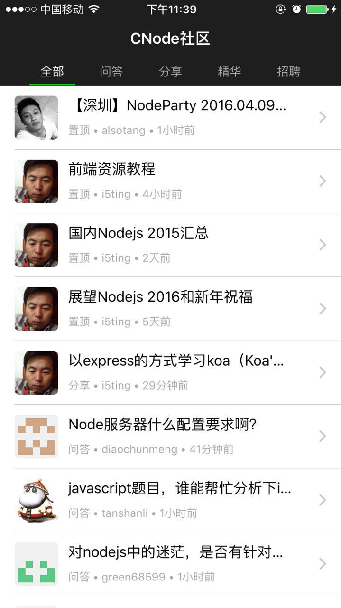
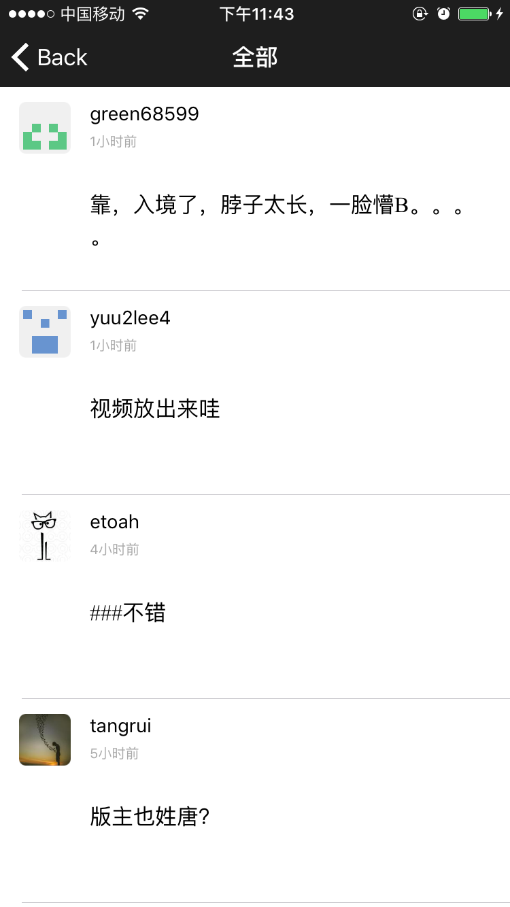

## swift-cnode

[CNode社区](https://cnodejs.org/) 的又一 swift 客户端，未完成...不定期更新，欢迎 fork 与 PR。

### 截图





### 遇到的坑

尝试使用 swift 开发的第一个应用，几乎一步一坑。。。特地记录一下

- 之前用 Alamofire 报 App Transport Security has blocked a cleartext HTTP (http://) resource load since it is insecure 的错误，解决方法：http://stackoverflow.com/questions/32695636/app-transport-security-has-blocked-a-cleartext-http-http-resource-load-sinc。
- this class is not key value coding-compliant for the key 。解决方法：http://stackoverflow.com/questions/3088059/what-does-this-mean-nsunknownkeyexception-reason-this-class-is-not-key
- viewController 重命名为 MainViewController（包含UITableViewController），storyboard 关联不上 class。解决方法：继承 UITableViewController，而不是 UITableViewDelegate 和 UITableViewDataSource。原因不明。。
- 固定avatar大小用右下角倒数第二个constraints（Pin），约束width和height，一定要点 Add constraints!
- tableviewcell 设了 rowHeight 没有生效。解决方法：设 tableview 的 rowHeight。
- Enum 真难用，通过变量key想取到rawValue，只能用 switch?见 models/Tab.swift。
- 格式化日期如："2016-03-26T01:54:02.931Z” 必须指定  dateFormatter.dateFormat = "yyyy-MM-dd’T’HH:mm:ss.SSSZ"，否则不生效。
- 注意 viewDidLoad 和 viewDidAppear 的区别。参考：http://www.xuebuyuan.com/2049893.html
- 使用 PageMenu 遇到一个奇怪的问题。自己往 storyboard 中拖拽进去的 Navigation 的 View 包含 Navigation Item（灰色），而 PageMenu 的 demo 中不包含（白色）。查了所有属性一模一样。详见：https://github.com/nswbmw/swift-pageMenu-demo 的 storyboard，原因不明。。
- PageMenu 使用的 .xib，改成使用 storyboard 的话，可以通过： let mainStoryboard: UIStoryboard = UIStoryboard(name: "Main", bundle: NSBundle.mainBundle());  mainStoryboard.instantiateViewControllerWithIdentifier("topicListsTableView") 获取对应 view 的 controller。参考：https://github.com/HighBay/PageMenu/issues/160
- 模拟器调试ok，真机也ok，后来有一次遇到模拟器ok，真机报 linker command failed with exit code 1 错误，查了半天，最后清下xcode缓存重启xcode解决了。。
- 设置 avartar 圆角不太起作用，有时候一侧圆角，一侧直角。解决方法：不止设  cornerRadius，还要设 view.layer.masksToBounds = true。
- Expected declara。解决方法：把代码放到  viewDidAppear 或  viewDidLoad 内部，而非外部。
- 断网情况下应用崩溃，handle 网络错误并弹出提示。toast 用 JLToast
- 代码区上面突然多出一大块灰色的区域，重启xcode就好了。。
- 删除 Assets.xcassets 里某张图片时不小心把整个 Assets.xcassets 都删了。解决方法：从回收站还原，虽然此时能编译成功了，但还要手动把 Assets.xcassets 拖到 xcode 里，蛋疼。。
- pull to refresh 时崩溃，报： unrecognized selector sent to instance 0x7fa93ae4cd70 错误。解决方法：将 refresh 函数定义到  viewDidAppear 外！参考：http://www.th7.cn/Program/IOS/201505/444808.shtml
- 各种尺寸的 icon 用 appicon 生成的。
- 修改最后生成的应用的名称需要到  BuildSettings -> Packaging -> Product Name 修改
- 设置应用图标需要把图标放到 Assets.xcassets->Appicon下。icon 有透明背景会变成黑色。。
- 上拉加载参考的 https://github.com/i-schuetz/tableview_infinite/blob/master/AsyncTableView%2FViewController.swift#L58-L65
- 运算符之间不能有空格。。。如 3/ 2是错的
- 函数定义时的参数顺序调用时也要一样。。。
- UILable 文字自动折行，在 storyboard 中设置 lines = 0
- 图片在 view 中居中，需要设左右constraints 都为0.。都为 223 等其他相同的值也不生效。。。imageview的arttributes inspector->view->mode需设置为center，而label的需要设置为scale to fill，原因不明。。。
- 设置 launchscreen 显示时间将  NSThread.sleepForTimeInterval(1) 放到 AppDelegate 的  application 里，参考：http://blog.csdn.net/lwjok2007/article/details/46442105
- 不能在 viewController 内定义名 title 的变量，会与 viewController.title 冲突。
-  点击 tableviewcell 跳转到详情页传参，参考 https://github.com/JakeLin/Todo/blob/master/Todo/ViewController.swift#L130-L139
- UILable 字体加粗隐藏在Lable->font里
- webview底部有一条黑线，解决方法：http://stackoverflow.com/questions/21420137/black-line-appearing-at-bottom-of-uiwebview-how-to-remove
- 隐藏webview的滚动条不是在 css  设置，也不能直接 webview. showsVerticalScrollIndicator = false。而是： webview.scrollView.showsVerticalScrollIndicator = false。。。。浪费了好长时间
- webView 禁止页面回弹用 web.scrollView.bounces=false，参考：http://www.aiuxian.com/article/p-609499.html
- 蛋疼的是有些设置需要设置webView的属性，有的需要在webView内设置（用js或css）
- 监听 webView 加载完成的事件(如 webViewDidFinishLoad)需要继承  UIWebViewDelegate，不要忘记 webView.delegate = self，参考：http://stackoverflow.com/questions/24305722/uiwebview-webviewdidloadfinish-method-not-called
- 计算webView高度参考：

```
- (void)webViewDidFinishLoad:(UIWebView *)webView

{
// CGRect frame = webView.frame;
// frame.size.height = 1;
// webView.frame = frame;
// CGSize fittingSize = [webView sizeThatFits:CGSizeMake(frame.size.width, FLT_MAX)];
// frame.size = fittingSize;
// webView.frame = frame;

float height = [[webView stringByEvaluatingJavaScriptFromString:@"document.body.offsetHeight;"] floatValue];
webView.frame = CGRectMake(0, 0, 320, height+10);
webView.userInteractionEnabled = NO;
}
```

- webView里内嵌了一个scrollView。scrollView 详解见：http://www.cnblogs.com/iCocos/p/4655757.html
- 监听 scrollView 的事件需继承  UIScrollViewDelegate 并设置  webView.scrollView.delegate = self
- 代码创建右上角的 navigation item button： self.navigationItem.rightBarButtonItem = UIBarButtonItem(…)，参考：http://stackoverflow.com/questions/31845915/how-can-i-get-a-navigation-bar-button-to-segue
- segue 的使用，参考：http://blog.chinaunix.net/uid-26722078-id-4892524.html
- 去掉tableViewCell 右边的右箭头，需设置 storyboard中Accessory->None，设置不能编辑：Behavior->取消Editable
- 使用数组的 .reverse 返回 ReverseRandomAccessCollection 类型。解决方法：Array([xxx].reverse())。参考：http://stackoverflow.com/questions/34558390/why-does-the-reverse-function-in-the-swift-standard-library-return-reverserand
- 出现 xxx to the UIWebView is invalid. Outlets cannot be connected to repeating content. 的错误。原因：通过 IBOutlet 和  viewWithTag 引用了两次。